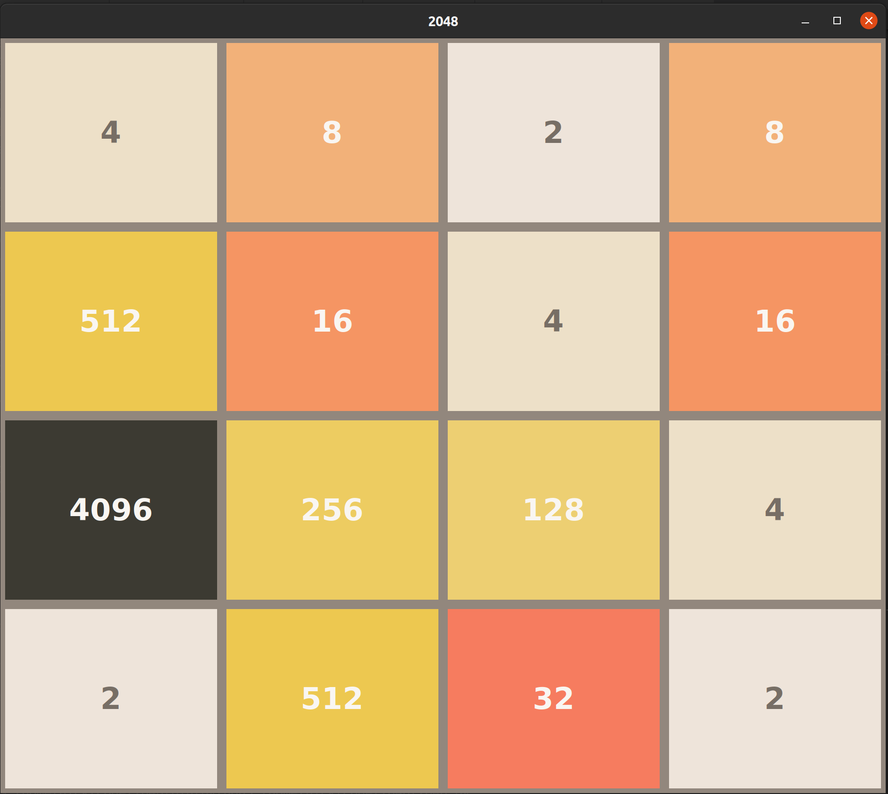

## 2048

Python implementation of 2048 supporting free-play and an AI that reaches 4096+.

## AI

The AI uses an expectiminimax heuristic approach. We maximise over player actions (up, left, down, right), and minimise over the adversary actions (the adversary being the game, with its action being placing a tile in a random cell). We take the expected score of the adversary action, considering the probability that the tile is a 2 (0.9) or a 4 (0.1). 

When we reach a set depth of the search tree (or terminate for another reason, e.g the branch has become exceedingly unlikely) we calculate the heuristic, taking into account the number of empty cells, the sum of the tiles (with higher weight on larger tiles), the monotinicity of the tiles, and the tiles ready to be merged.

### Bitboard Representation

The board is represented as a 64 bit binary number, with each cell occupying 4 bits, being represented by the log of number in the cell (for numbers larger than 0). This allows 16 possibilities for each cell (including 0), so we have a maximum number of 2^15 = 32768, which should be plenty big enough for this game.

This allows us to keep the entire board in a single 64 bit register, allowing for high performance manipulation.

## Action Processing and Heuristic Calculation

Lookup tables are pre-computed before start, mapping 16 bit rows to their equivalent merge-right row and heurstic calculation. Operations up, down and left can be computed easily using reversing and transpotition binary operations. This way, merges and heuristic calculations can be done extremely quickly by simply looking up the value in memory.

There are 2^16 = 65536 possible rows, which can easily be held in memory.
